# Active Directory Home Lab

A fully functional corporate Active Directory environment built from scratch using VirtualBox. This project demonstrates hands-on experience with Windows Server administration, domain services, network configuration, Group Policy enforcement, and real-world troubleshooting.

## Lab architecture

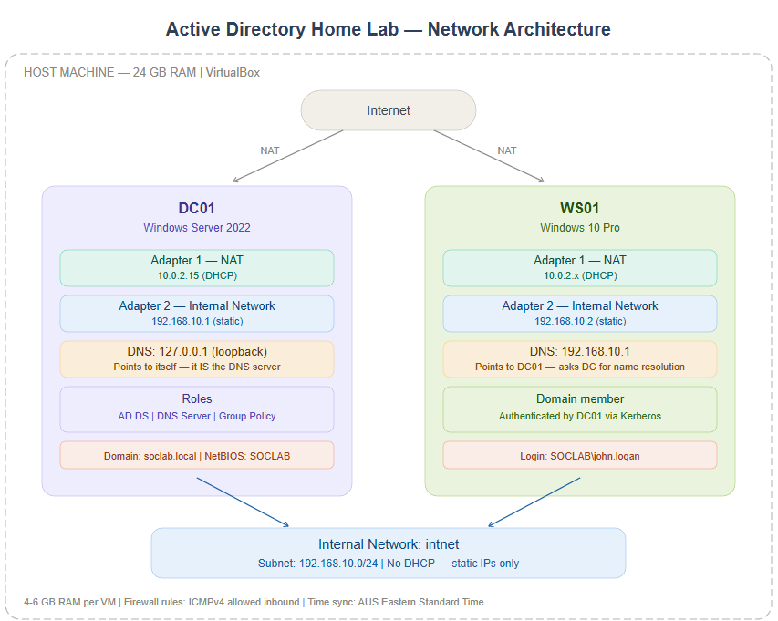

| | DC01 (Domain Controller) | WS01 (Client Workstation) |
|---|---|---|
| **OS** | Windows Server 2022 Standard | Windows 10 Pro |
| **Network** | Dual NIC: NAT (internet) + Internal Network | Dual NIC: NAT (internet) + Internal Network |
| **IP (Internal)** | 192.168.10.1 (static) | 192.168.10.2 (static) |
| **DNS** | 127.0.0.1 (self — it hosts the DNS role) | 192.168.10.1 (points to DC01) |
| **Domain role** | Forest root DC for soclab.local | Domain member workstation |

**Domain:** soclab.local | **Host:** 24 GB RAM, VirtualBox

---

## Skills demonstrated

### Windows Server deployment and configuration
Deployed Windows Server 2022 with Desktop Experience and performed pre-AD hardening: renamed the server to follow enterprise naming conventions (DC01) before promotion to avoid DNS and certificate issues, and configured a static IP on the internal adapter since all domain clients depend on the DC's IP for DNS resolution and authentication.

### Active Directory Domain Services
Built a new AD forest (soclab.local) from scratch, including AD DS role installation, DNS Server integration, and domain controller promotion. Configured the domain structure with 5 Organisational Units representing corporate departments (IT, Marketing, HR, Financial, Sales) and created domain user accounts with consistent naming conventions (firstname.lastname).

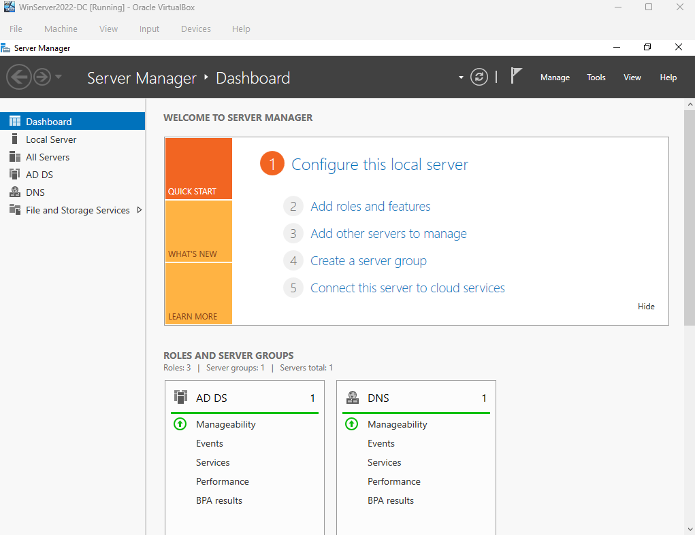

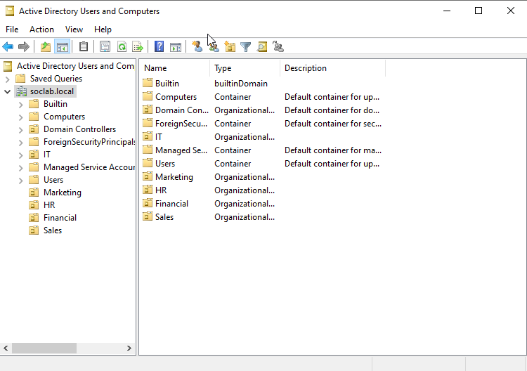

### Network design and dual-adapter architecture
Designed a network topology using two adapters per VM: NAT for internet access and Internal Network for isolated domain traffic. This mirrors enterprise environments where management and production traffic are segmented. Configured static IPs with appropriate DNS settings — the DC points DNS to loopback (127.0.0.1) because it hosts the DNS role, while clients point to the DC's IP.

### Group Policy enforcement
Configured domain-wide security policies through the Default Domain Policy GPO:

| Policy | Default | Configured | Rationale |
|--------|---------|------------|-----------|
| Minimum password length | 7 chars | 14 chars | NIST SP 800-63B recommends at least 15 characters, but the Group Policy GUI enforces a maximum of 14. Fine-Grained Password Policies would be needed for 15+. 14 chars still dramatically increases brute-force complexity |
| Maximum password age | 42 days | 90 days | See note below on password expiration debate |
| Account lockout threshold | Disabled | 5 attempts | Prevents brute-force attacks while tolerating occasional typos |
| Lockout duration | N/A | 30 minutes | Auto-unlock after cooling period avoids permanent lockouts |

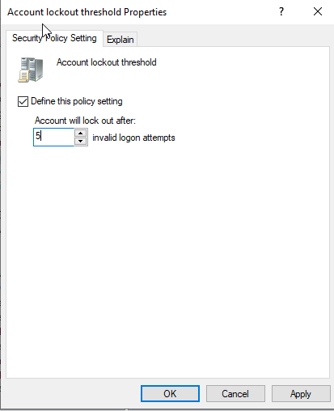

> *Note on password expiration: NIST SP 800-63B (Section 5.1.1.2) recommends against periodic password changes, stating that users tend to choose weaker passwords when they know they will have to change them soon, often applying predictable transformations (Password1 → Password2). NIST recommends forcing a change only when there is evidence of compromise. However, many enterprise frameworks such as PCI-DSS still require periodic rotation (typically 90 days), and most corporate environments continue to enforce it. This lab uses 90-day expiration to reflect common enterprise configurations, while acknowledging that modern guidance is shifting toward longer, event-based password changes combined with MFA.*

Verified policy application on the client workstation using `gpresult /r`, confirming the Default Domain Policy was received from DC01 and the machine was registered as a Member Workstation (CN=WS01,CN=Computers,DC=soclab,DC=local).

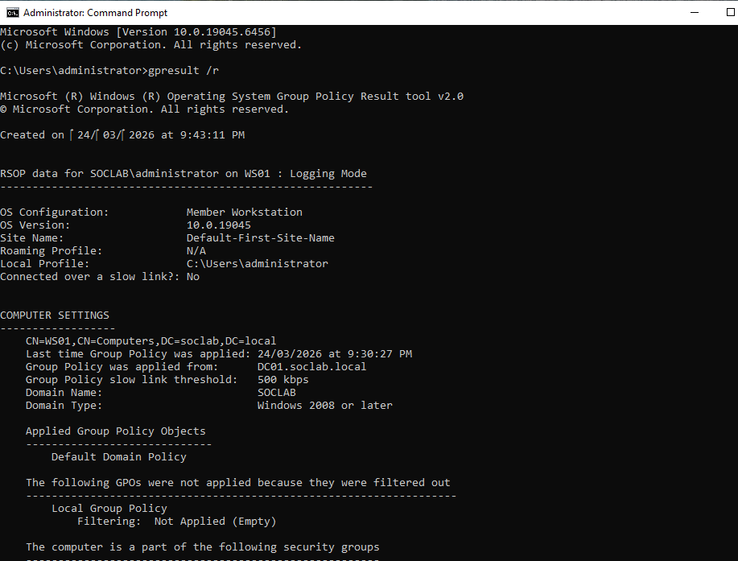

Tested account lockout by simulating failed login attempts, confirmed the account was locked after 5 attempts and successfully unlocked it via AD Users and Computers (a common Service Desk workflow).

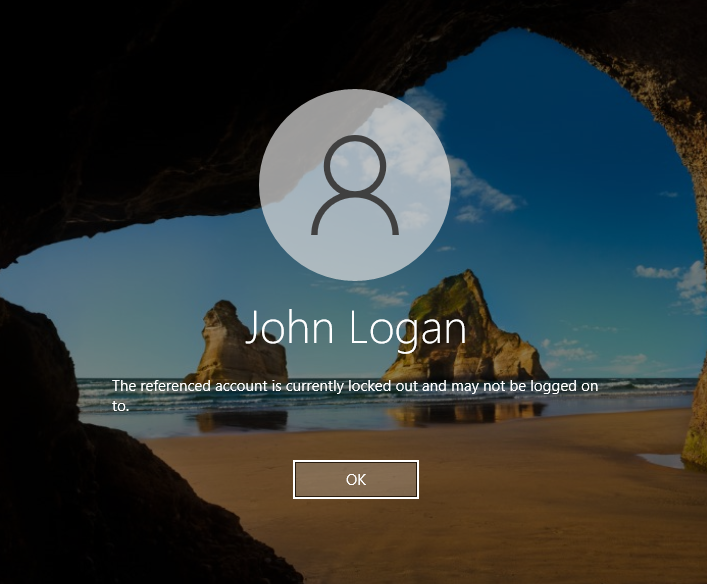

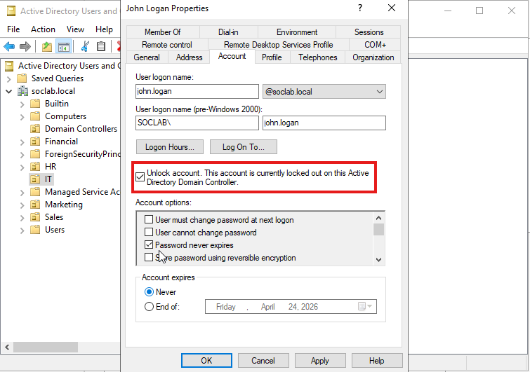

> *Note: "Password never expires" is enabled on lab accounts for practical convenience. In a production environment, password expiration would be enforced via the Group Policy configured in this lab (90-day maximum age) combined with user notification policies.*

### Domain authentication
Successfully joined the Windows 10 client to the domain and authenticated using domain credentials (SOCLAB\john.logan), demonstrating the full Kerberos authentication chain: client sends credentials to DC, DC validates against AD, access granted.

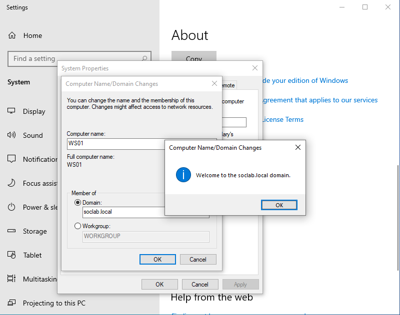

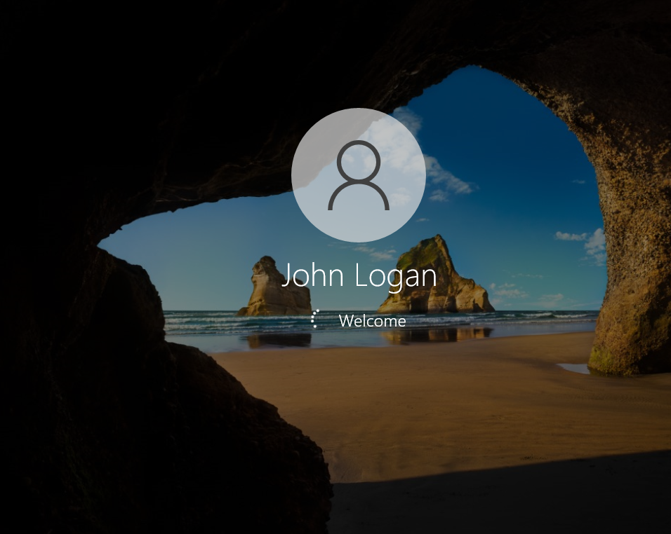

---

## Troubleshooting

Documenting problems solved during the build, these reflect real issues encountered in enterprise environments.

### Firewall blocking inter-VM communication
**Symptom:** Ping between VMs returned "Request timed out" despite correct IPs on the same subnet.

**Root cause:** Windows Firewall blocks inbound ICMP by default, a security feature, not a misconfiguration.

**Resolution:** Added inbound ICMPv4 allow rules on both machines. Noted a syntax difference between Windows Server (`protocol=icmpv4:8,any`) and Windows 10 (`protocol=icmpv4`).

**Takeaway:** "Request timed out" (packet sent, no response) is different from "Destination host unreachable" (routing issue) — distinguishing these narrows troubleshooting significantly.

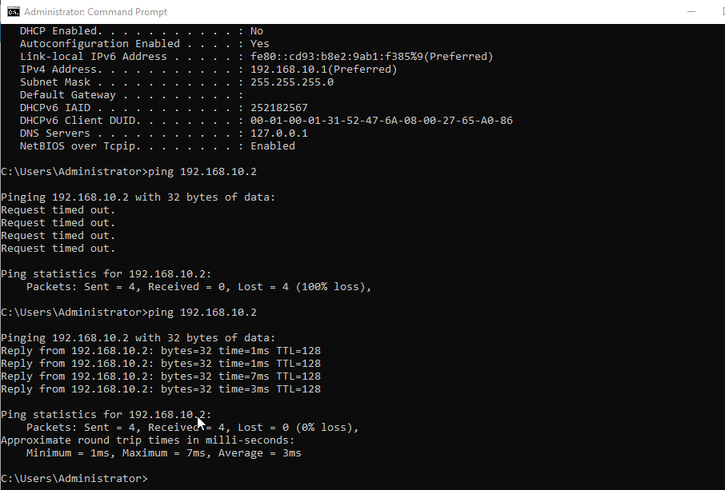

### Kerberos authentication failure due to timezone mismatch
**Symptom:** `gpupdate /force` failed with clock synchronisation error. `w32tm /resync` reported "the required time change was too big."

**Root cause:** DC01 was set to Pacific Standard Time while WS01 was on AUS Eastern Standard Time. Despite both showing the same local time, the UTC difference was ~18 hours. Kerberos requires clocks within 5 minutes.

**Resolution:** Aligned timezones on both VMs, manually corrected the server clock, restarted the Windows Time service, and forced resync. Confirmed resolution with successful `gpupdate /force`.

**Takeaway:** Always verify timezone (`tzutil /g`), not just displayed time. The DC is the authoritative time source for the domain — all clients sync from it.

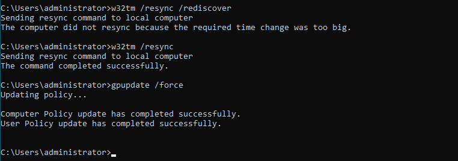

### AD rejecting user password during creation
**Symptom:** Password "John4321@" was rejected for user John Logan.

**Root cause:** Default AD password policy prohibits passwords containing the user's account name or display name.

**Takeaway:** AD enforces complexity rules automatically — useful for security, important to know for Service Desk (explaining to users why their password was rejected).

---

## Networking concepts applied

This lab applied networking fundamentals across multiple OSI layers:

| Concept | Application in this lab |
|---------|------------------------|
| Static vs DHCP addressing | DC requires static IP; NAT adapter uses DHCP |
| Subnet design (192.168.10.0/24) | Both VMs on same subnet for domain communication |
| DNS architecture | DC hosts DNS, resolves domain names; clients query DC |
| NAT | VirtualBox NAT translates private IPs for internet access |
| APIPA (169.254.x.x) | Observed when Internal Network had no DHCP or static config |
| Loopback (127.0.0.1) | DC DNS points to self because it IS the DNS server |
| Kerberos authentication | Domain login requires time sync within 5 minutes |
| ICMP / Firewall rules | Default Windows policy blocks ping; explicit rules needed |
| Principle of Least Privilege | OUs + Group Policies restrict access per department |

---

## Tools and technologies

- **Windows Server 2022:** AD DS, DNS Server, Group Policy Management
- **Windows 10 Pro:** Domain-joined client workstation
- **Oracle VirtualBox:** Virtualisation platform with dual-NIC configuration
- **Active Directory Users and Computers:** OU/user management
- **Group Policy Management Console:** GPO creation and enforcement
- **Command line tools:** ipconfig, ping, netsh, gpupdate, gpresult, w32tm, tzutil

---

## References

- [NIST SP 800-63B: Digital Identity Guidelines](https://pages.nist.gov/800-63-FAQ/#q-b05) - Modern password policy recommendations
- [Microsoft Learn: AD DS Overview](https://learn.microsoft.com/en-us/windows-server/identity/ad-ds/get-started/virtual-dc/active-directory-domain-services-overview)
- [Microsoft Learn: Kerberos Authentication](https://learn.microsoft.com/en-us/windows-server/security/kerberos/kerberos-authentication-overview)
- [Microsoft Learn: Group Policy Overview](https://learn.microsoft.com/en-us/windows-server/identity/ad-ds/manage/group-policy/group-policy-overview)

---

*Built by Beatriz Martins Costa | March 2026*
